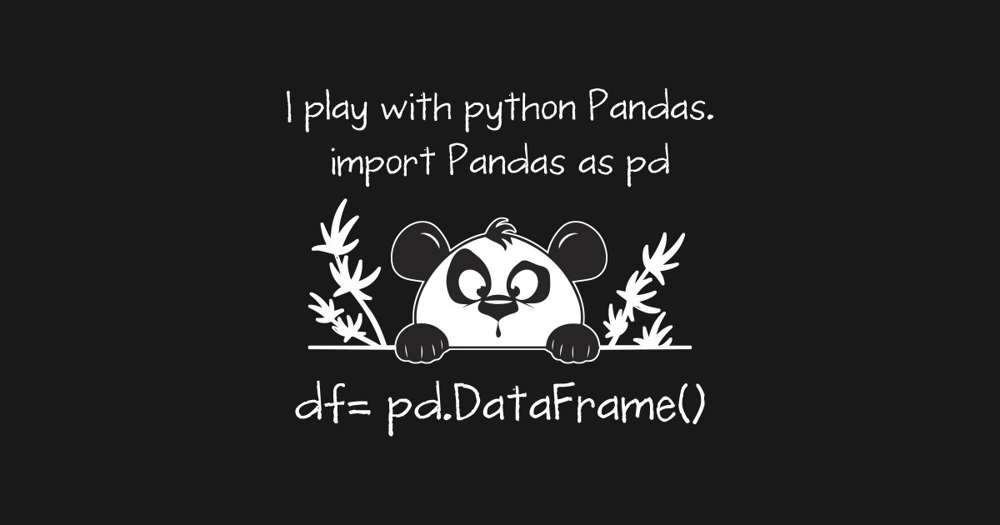

#  Data Manipulation with Pandas 

&nbsp;

**Welcome!**  In this Study Group we have a Jupiter notebook, where we are going to talk about **The powerful Pandas library**. _By Liliana Torres_

Pandas is one of those package that makes importing and analyzing data much easier.

Pandas contains data structures and data manipulation tools designed to make data cleaning and analysis fast and easy in Python. Pandas adopts many coding idioms from  NumPy, by contrast, is best suited for working with homogeneous numerical array data.

Pandas is very powerful library that has a great functionality. You don't have to know it all. You can learn the basics and always refer to the documentation.
&nbsp;

## Pandas Topics Reviewed:

_Here's some docs & posts to refer to as we go through the lesson (click the arrows to show links)._

    

      Pandas General References
    

 *  [**Pandas PyData Reference**](https://pandas.pydata.org/pandas-docs/stable/)

    

      Pandas data Structures
    

 *  [**RPython for Data Science Handbook Pandas Data Structures**](https://jakevdp.github.io/PythonDataScienceHandbook/03.01-introducing-pandas-objects.html)

    

      Pandas Basics of Manipulation of Data
    

*  [**Towards Data Science Dataframe basics and manipulation  of data**](https://towardsdatascience.com/python-pandas-data-frame-basics-b5cfbcd8c039)

 

  

    

      How to Use LOC method
    

*  [**Sharp Sight How to use Pandas LOC to Subset Python**](https://www.sharpsightlabs.com/blog/pandas-loc/)

 

    

      Resource Pandas Exercises to practice
    

*  [**W3 Resource Pandas Exercises to practice**](https://www.w3resource.com/python-exercises/pandas/index.php)

 

    

      Pycon Pandas Tutorial Exercises by Brandon Rhodes  
    

    
*  [**Pycon Pandas Tutorial Exercises by Brandon Rhodes**](https://github.com/brandon-rhodes/pycon-pandas-tutorial)

 

